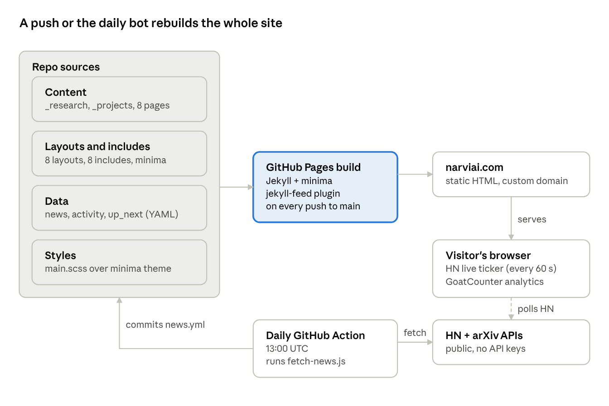

# Repo Analysis: fastpackcyclist-lgtm.github.io

Sep 29, 2026 · Raju Vedprakash

## Summary

The repo is a solid, working foundation. It needs content and some hardening more than new features. It powers NARVI ([narviai.com](https://narviai.com)), Akeim Joseph's Jekyll site on GitHub Pages about applied AI research, A.R.C.H.O.N. and PRISM.

- **Age and activity:** 39 commits since the first on Sep 15, 2026. 10 of them are the daily news bot.
- **What's live:** 2 research papers (about 6,500 words in total), 3 project pages, About, CV, an automated News page and a private Admin page.
- **What's empty:** Journal, Notes, Research Prototypes, Research Tests and `_posts`.
- **Main risks:** the RSS feed is empty, the sitemap reference is wrong, a failed news fetch can wipe the feed, the Activity rail is out of date, and there's no README, Gemfile or build check.

No code was changed for this analysis.

## Architecture and tech stack

It's a standard GitHub Pages Jekyll site on the `minima` theme, with no custom plugins. Everything is Liquid templates plus one Node script, about 990 lines in all.

The site is rebuilt on every push to `main`, including the bot's news commit. Only the news ticker and analytics run after the page loads.

| Layer | Files | Role |
| --- | --- | --- |
| Config | `_config.yml` | Title, 4 collections (projects, journal, notes, research), nav order, GoatCounter code |
| Layouts | 8 in `_layouts/` (hub-index, filtered-index, collection-index, research-entry, project, news-index, admin, home) | Hubs group a collection by a front-matter field. Filtered pages show one group. |
| Includes | 8 in `_includes/` | Header, nav and footer overrides, plus the Up Next and Recent Activity side rails |
| Styles | `assets/main.scss` (466 lines) | Dark-theme overrides on top of minima |
| Data | `_data/*.yml` | News (generated), activity log and up-next queue (both hand-edited) |
| Domain | `CNAME` | narviai.com |

## Content inventory

7 nav sections are live, but 4 of the 9 content buckets hold nothing yet.

| Section | Source | Items | State |
| --- | --- | --- | --- |
| Home | `index.md` (hero, focus grid, mission) | 1 page | Done |
| About | `about.md` | 1 page | Done |
| Research: Papers | `_research/` with `type: paper` | 2 (Sep 19, Sep 25) | Active |
| Research: Prototypes | `_research/` with `type: prototype` | 0 | Empty |
| Research: Tests | `_research/` with `type: test` | 0 | Empty |
| Projects: Private R&D | `_projects/` (A.R.C.H.O.N., SFT Command) | 2 | Done |
| Projects: Public Research | `_projects/prism.md` | 1 | Thin (1 paragraph) |
| Journal | `journal` collection (no `_journal/` folder) | 0 | Empty |
| Notes | `notes` collection (no `_notes/` folder) | 0 | Empty |
| News | `_data/news.yml` (bot-generated) | 10 HN + 6 arXiv | Automated |
| CV | `cv/index.md` + resume PDF | 1 page | Done |
| Admin | `admin/index.md`, not in nav | 1 page | Internal |

The Research hub page also states 5 standing research questions. Only one is queued in `_data/up_next.yml` (Closed-world tool grounding).

## Automation and analytics

The site has one scheduled job. Everything else is static or runs in the visitor's browser.

| Piece | What it does | Notes |
| --- | --- | --- |
| `.github/workflows/fetch-news.yml` | Runs daily at 13:00 UTC and on manual dispatch. Runs the script and commits `_data/news.yml` if it changed. | Needs `contents: write`. Commits with `[skip ci]`, but the push still triggers a Pages rebuild. |
| `scripts/fetch-news.js` | Node 22 with no dependencies. Pulls HN front-page stories with 40+ points (top 10) and the 6 newest arXiv papers in cs.AI, cs.CL and cs.MA. | Hand-rolled YAML writer and regex Atom parser. No API keys. |
| News page live ticker | Browser JS polls Algolia's HN API every 60 s for the top front-page story. | Runs every minute while the tab is open. It is the site's only third-party runtime call besides analytics. |
| GoatCounter | `head.html` loads the script once `goatcounter_code` is set (it is: `akeimjoseph`). | Privacy-friendly, no cookies. The dashboard is linked from Admin. |
| Admin page | Word counts, read times, news-feed health, traffic link. | Hidden by `robots.txt` and `noindex` only. There is no authentication, and the page says so itself. |

## Findings

**Strengths.** The layouts are data-driven: a new research type or project category is one front-matter entry, with no template change. The commit messages are clear and explain why each fix was made. The news pipeline needs no dependencies or keys. The written content is specific and has a distinct voice.

**Issues**, most important first:

| # | Issue | Where | Impact | Severity |
| --- | --- | --- | --- | --- |
| 1 | The RSS feed is empty. `jekyll-feed` only publishes `_posts`, and all content lives in collections. | `_config.yml`, `_posts/` | Subscribers and aggregators see no papers. | High |
| 2 | `robots.txt` lists `/feed.xml` as the sitemap, but it's an Atom feed. There is no `jekyll-sitemap`. | `robots.txt` | Search engines get no real sitemap. | High |
| 3 | If HN or arXiv returns an HTTP error, the script writes an empty list, and the bot commits it. | `scripts/fetch-news.js` (`fetchHN`, `fetchArxiv`) | One bad API response blanks the News page for a day. | Medium |
| 4 | The Activity rail stops at Sep 16. It misses both papers, News, Admin and analytics. | `_data/activity.yml` | A feed that says it "stays true to the repo" is out of date on every page. | Medium |
| 5 | There's no README and no `Gemfile`. | repo root | No reproducible local build and no pinned `github-pages` version. | Medium |
| 6 | Nothing builds or checks the site before merge (no Jekyll build or link check). | `.github/workflows/` | Broken Liquid or links reach production unnoticed. The git log already shows 6 fix-after-ship commits. | Medium |
| 7 | The news bot pushes without pulling first, and the workflow has no concurrency guard. | `fetch-news.yml` | The daily job fails if a manual push lands mid-run. | Low |
| 8 | The Admin content table leaves out projects, though its heading counts them. | `_layouts/admin.html` | A minor inconsistency. | Low |
| 9 | SFT Command (wound down) sits under "Private R&D" next to active A.R.C.H.O.N. | `_projects/sft-command.md` | Readers may take it for current work. | Low |
| 10 | 4 of 9 content buckets are empty, and PRISM's page is a single paragraph. | Journal, Notes, Prototypes, Tests | Half the nav leads to "Nothing here yet." | Content |

## Recommended approach

Fix discoverability and reliability first. They are small changes with outsized effect. Then add a build check, then turn to content. Each phase can ship as its own PR.

**Phase 1 — Discoverability (about half a day)**

- [ ] Add `jekyll-sitemap` to `plugins`. Point `robots.txt` at `/sitemap.xml`.
- [ ] Make the feed include papers. Either set `feed: collections: [research]` for `jekyll-feed`, or publish papers as `_posts` with a `research` category.
- [ ] Check with Google Search Console that `narviai.com` is verified and the sitemap is accepted.

**Phase 2 — Reliability (about half a day)**

- [ ] In `fetch-news.js`, keep the previous `tech` or `articles` list when a source returns an error or zero items. Exit non-zero so the run shows red.
- [ ] In `fetch-news.yml`, add `concurrency: fetch-news` and a `git pull --rebase` before the push.
- [ ] Add a `pages-build` workflow on pull requests: `bundle exec jekyll build`, then `htmlproofer` for internal links.
- [ ] Add a `Gemfile` pinned to `github-pages`, and a short README with the local run command.

**Phase 3 — Accuracy and housekeeping (about 1 hour)**

- [ ] Bring `_data/activity.yml` up to date through Sep 25. Consider generating it from commit history or front-matter dates so it can't drift.
- [ ] Add projects to the Admin content table, or drop them from its heading count.
- [ ] Move SFT Command to an "Archived" category, or put its wound-down status on the card.

**Phase 4 — Content (ongoing)**

- [ ] Write the queued paper "Closed-world tool grounding" from `up_next.yml`.
- [ ] Seed Notes with 2–3 short pieces. The "Tying it together" note already in Up Next is a natural first.
- [ ] Expand PRISM's project page to match A.R.C.H.O.N.'s structure.
- [ ] Until Journal, Prototypes and Tests have entries, hide them from the nav and hub cards. Or give each one a first entry.

**Later, only if needed:** giscus comments (already planned on the Admin page), and real auth for Admin only if it ever holds anything sensitive.

Open question: does the owner want the daily bot commits in `main`'s history? Committing news to a separate data branch would keep the log readable.
